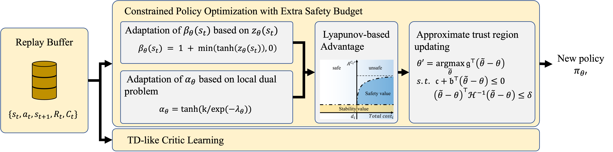

# ESB-CPO

## Efficient Exploration Using Extra Safety Budget in Safe RL (in submission)

The whole framework is shown as follow:




  - [Method](#Method)
  - [Installation](#installation)
  - [Getting Started](#getting-started)
  - [Team](#team)
  - [Acknowledgement](#acknowledgement)

## Method
This paper improves upon the trade-off between reducing constraint violations and improving expected return. The main idea is to encourgae the early exploration by adding exrta safety budgets for unsafe transitions. With the process, the extra safety budgets become very close to 0, thus meeting the safety demand gradually. Interestingly, we find that the Lyapunov-based Advantage Estimation (LAE) we propose is a novel and effective metric to evaluate the transitions in the environment.

- [Project webpage](https://sites.google.com/view/dominorl/)

## Installation

### Mujoco
MuJoCo stands for Multi-Joint dynamics with Contact. It is a general purpose physics engine that aims to facilitate research and development in robotics, biomechanics, graphics and animation, machine learning, and other areas which demand fast and accurate simulation of articulated structures interacting with their environment. You can install from [Mujoco github](https://github.com/deepmind/mujoco).

### Safety Gym
Safety Gym, a suite of environments and tools for measuring progress towards reinforcement learning agents that respect safety constraints while training. You can install from [Safety Gym github](https://github.com/openai/safety-gym).

### Bullet Safety Gym
"Bullet-Safety-Gym" is a free and open-source framework to benchmark and assess safety specifications in Reinforcement Learning (RL) problems.[Bullet Safety Gym github](https://github.com/SvenGronauer/Bullet-Safety-Gym).

### Conda-Environment

```
conda create -n ESBCPO python=3.7
conda install pytorch torchvision torchaudio pytorch-cuda=11.7 -c pytorch -c nvidia
pip install -e .
```
### Machine Configuration
We test all algorithms and experiments in CPU: **AMD Ryzen Threadripper PRO 5995WX 64-Cores** .

## Getting Started
#### Train
Our algorithm codes are in file: *esbcpo/algos*, for example, if you want to run ESB-CPO in safety gym: Safexp-PointGoal1-v0, with cpu cores:4, seed:0,

```
python train.py --env_id Safexp-PointGoal1-v0 --algo esb_cpo --cores 4 --seed 0
```
#### Configures
| Argprase                  | default     | info                                                         |
| ------------------------- | ----------- | ------------------------------------------------------------ |
| --algo                    | required    | the name of algorithm exec                                   |
| --cores                   | int         | the number of cpu physical cores you use                     |
| --seed                    | int         | the seed you use                                             |
| --check_freq              | int: 25     | check the snyc parameter                                     |
| --entropy_coef            | float:0.01  | the parameter of entropy                                     |
| --gamma                   | float:0.99  | the value of dicount                                         |
| --lam                     | float: 0.95 | the value of GAE lambda                                      |
| --lam_c                   | float: 0.95 | the value of GAE cost lambda                                 |
| --max_ep_len              | int: 1000   | unless environment have the default value else, we take 1000 as default value |
| --max_grad_norm           | float: 0.5  | the clip of parameters                                       |
| --num_mini_batches        | int: 16     | used for value network tranining                             |
| --optimizer               | Adam        | the optimizer of Policy other : SGD, other class in torch.optim |
| --pi_lr                   | float: 3e-4 | the learning rate of policy                                  |
| --steps_per_epoch         | int: 32000  | the number of interactor steps                               |
| --target_kl               | float: 0.01 | the value of trust region                                    |
| --train_pi_iterations     | int: 80     | the number of policy learn iterations                        |
| --train_v_iterations      | int: 40     | the number of value network and cost value network iterations |
| --use_cost_value_function | bool: False | use cost_value_function or not                               |
| --use_entropy             | bool:False  | use entropy or not                                           |
| --use_reward_penalty      | bool:False  | use reward_penalty or not                                    |

We recommend you to take a look at *esbcpo/cfgs* to get more infomations about the parameters of algorithms and environments.

## Team
This project is maintained by [Haotian Xu](https://github.com/Xu-ht) , [Shengjie Wang](https://github.com/Shengjiewang-Jason) at Tsinghua University. 

## Acknowledgement

We appreciate the following github repos a lot for their valuable code base implementations: 

https://github.com/PKU-MARL/Safe-Policy-Optimization

